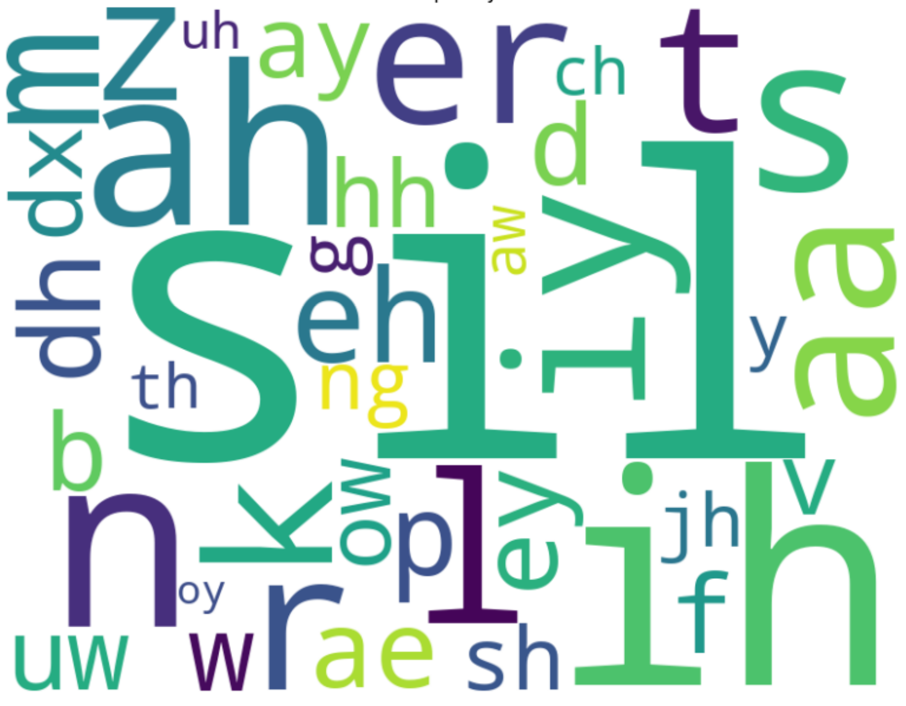
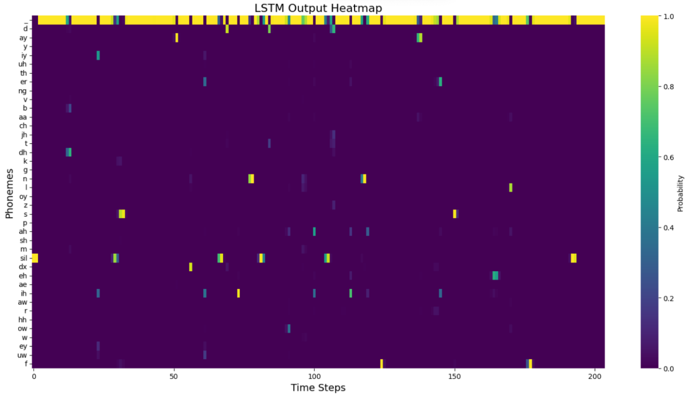

# End-to-End Speech Recognition Using BiLSTM and CTC on TIMIT
## Overview

This project implements an end-to-end **Automatic Speech Recognition (ASR)** system based on **Bidirectional LSTM (BiLSTM)** networks and the **Connectionist Temporal Classification (CTC)** loss, trained on the **TIMIT** acoustic-phonetic corpus.  
<p align="center">
  
  
</p>


## Background
### The TIMIT Dataset
TIMIT is a phonetically transcribed speech dataset recorded from 630 speakers of eight major American English dialects.  
It provides a balanced corpus for **phoneme-level recognition**, with 16 kHz 16-bit recordings.  

The ``fbank`` features are generated and saved in folder fbank.  The repo includes JSON manifests and FBank extraction. 
The features must be precomputed, run the provided preprocessing (or the notebook ``MLMI2_Lab.ipynb``, including almost all the processes) first.

### The CTC Framework
Connectionist Temporal Classification (CTC) enables training of sequence-to-sequence models **without explicit alignment** between input frames and output phoneme labels, making it ideal for ASR tasks.

## Repository Structure
```
ASR-CTC_TIMIT/
├── json/  # Training/validation/test metadata
├── fbank/  # folder saving fbank features
├── trainer.py  # Training pipeline
├── decoder.py  # Decoding utilities
├── decoding_visual.py  # Decode and visualise the model
├── models.py  # Model definitions (BiLSTM)
├── run.py  # Pipeline of setting params, training and saving the model
├── dataloader.py  # Data loading and JSON parsing
├── utils.py  # used for concating inputs
├── MLMI2 Lab.ipynb  # Jupyter Notebook for analysis
├── phone_map/  # 61→39 phone mapping
└── checkpoints/  # Saved model weights after training
```

## Training Setup

Training and decoding were conducted on the **University of Cambridge HPC cluster**, using SLURM scheduling and a single GPU node.  
Each experiment was allocated up to **20 GPU hours**, with approximately 12 hours used in total.  

You can run ``run.py`` to complete parameters setting, model trainig and model saving in one go.  


## Experimental Results
### Optimiser Comparison  

| Optimiser       | Initial LR | PER (%)  | Notes                                  |
| --------------- | ---------- | -------- | -------------------------------------- |
| SGD             | 0.5        | 31.7     | Stable convergence but slower learning |
| SGD + Scheduler | 0.5 → 0.05 | 25.9     | Learning rate decay improves stability |
| Adam            | 1e-3       | **23.6** | Fast and stable convergence            |
| Adam            | 5e-3       | 31.1     | Overshoots; unstable training          |

### Model Complexity 
| Configuration    | Hidden Size | Layers | PER (%)  | Observation                              |
| ---------------- | ----------- | ------ | -------- | ---------------------------------------- |
| 1-layer BiLSTM   | 128         | 1      | 30.2     | Baseline performance                     |
| 2-layer BiLSTM   | 128         | 2      | **23.4** | Best trade-off between accuracy and cost |
| 3-layer BiLSTM   | 128         | 3      | 24.1     | Slight overfitting                       |
| 2-layer Uni-LSTM | 128         | 2      | 35.7     | Context limited, poor accuracy           |

### Papameters Selection and Summary
| Finding                                                   | Explanation                                    |
| --------------------------------------------------------- | ---------------------------------------------- |
| **Dropout = 0.5** significantly improved robustness       | Reduced overfitting across all optimisers      |
| **Gradient clipping (3.0)** stabilised early training     | Prevented gradient explosion                   |
| **Adam (1e-3)** achieved the lowest PER                   | Optimal for this dataset and network scale     |
| **2-layer BiLSTM** gave the best accuracy-speed trade-off | Deeper networks slightly overfitted TIMIT      |
| **PER ≈ 23%** confirms reproducibility with literature    | Matches results from MLMI2 coursework baseline |

### Final System Performance
| Metric         | Development Set | Test Set | Description                         |
| -------------- | --------------- | -------- | ----------------------------------- |
| PER (39-phone) | 23.1            | **23.4** | Final model (2-layer BiLSTM + Adam) |
| PER (61-phone) | –               | 28.9     | Before mapping                      |
| Training Time  | 11.6 h          | –        | On 1× NVIDIA A100                   |
| Params         | 1.35 M          | –        | Compact BiLSTM-CTC architecture     |


